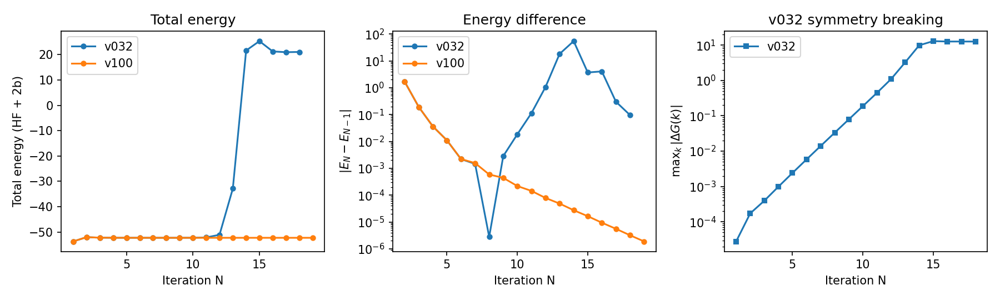

# Green MBPT v1.0.0 — benchmark summary

Release-time validation of `green-mbpt` **v1.0.0** (current data: `1.0.0a2`)
against the previous **v0.3.2** (`green-mbpt 0.3.0` / `green-mbtools 0.3.0`)
line, on the [green-benchmarks](../../README.md) HPC regression suite.
Each system is run on both CPU and GPU where available.

This document is the hand-written front door. The underlying numbers live in
the auto-generated tables — do not restate numbers elsewhere, link to these:

- [`RESULTS.md`](RESULTS.md) — per-system observables, all versions.
- [`COMPARISON.md`](COMPARISON.md) — pairwise differences and timing ratios.

## TL;DR

1. **Agreement.** Across the suite, total energies from v0.3.2 and v1.0.0
   agree to the convergence threshold (≲1e-7 Ha), on both CPU and GPU.
2. **A CPU bug is fixed.** `ge_x2c1e` (all-electron, full X2C spinor path)
   was broken on the v0.3.2 **CPU** kernel. v1.0.0 fixes it; CPU now matches
   the (always-correct) GPU path.
3. **Symmetry contamination is resolved.** On `black_p`, v0.3.2 self-energy
   iterations accumulate symmetry contamination and **diverge**; v1.0.0
   converges smoothly. This is the clearest single demonstration of the
   release's value.

---

## 1. Cross-version agreement

For the bulk of the suite, v0.3.2 and v1.0.0 produce the same physics. The
scalar totals — `ehf`, `e1b`, `ecorr` — agree to the 1e-7 Ha GW/SCF
convergence threshold across CPU and GPU (see the `CPU v032-v100` and
`GPU v032-v100` columns in [`COMPARISON.md`](COMPARISON.md)).

Two honest caveats, so the tables aren't over-read:

- **Spectral / gap quantities** (`cbm`, `vbm`, `*_gap*`, `homo`, `lumo`) come
  from analytic continuation and are far more sensitive; they can differ at
  the eV level between CPU and GPU *within the same version*. These are not
  part of the tight-agreement claim — the energies are.
- The input DFT is run without symmetry and carries an intrinsic asymmetry of
  ~1e-6, which sets the floor for what "agreement" can mean here.

The takeaway: **v1.0.0 reproduces v0.3.2 wherever v0.3.2 was correct**, so the
two findings below are genuine fixes, not incidental numerical drift.

---

## 2. Germanium — CPU X2C kernel bug, fixed in v1.0.0

X2C calculation in Germanium exercises the all-electron, full X2C (spinor) relativistic path.
On v0.3.2 the **CPU** kernel produces non-physical energies; the v0.3.2 **GPU**
kernel is already correct. v1.0.0 fixes the CPU path so it matches GPU.

Selected `gw` observables (from [`RESULTS.md`](RESULTS.md)):

| observable   | v0.3.2 CPU (broken) | v0.3.2 GPU | v1.0.0 CPU (fixed) | v1.0.0 GPU |
|--------------|--------------------:|-----------:|-------------------:|-----------:|
| `gw/ehf` Ha  |       -4408.28412022 | -4193.02363527 |      -4193.02363524 | -4193.02363524 |
| `gw/e1b` Ha  |       -4845.34405357 | -4843.15438780 |      -4843.15438799 | -4843.15438799 |
| `gw/ecorr` Ha |         -0.36652190 |    -1.00902271 |         -1.00902273 |    -1.00902273 |
| `gw/cbm` eV  |                   —  |     0.00906429 |          0.93362192 |     0.77046469 |

The v0.3.2 CPU `gw/ehf` is off by **~215 Ha** and its band structure is absent
(`—`) — i.e. the CPU run was non-physical, not merely imprecise. The other
three columns agree with one another. **v1.0.0 CPU reproduces the correct GPU
result**, closing the bug.

> Note: Ge with spin-free X2C1e (scalar-relativistic sfx2c1e) was *not* affected — see
> its row in `RESULTS.md` for the contrast.

---

## 3. Black Phosphorous — symmetry contamination and divergence, resolved in v1.0.0

Black phosphorus (`Cmce`, #64; the suite's only orthorhombic, non-symmorphic
case) is the sharpest demonstration. Both versions are run as a converging
self-consistent GW calculation (`itermax: 25`, `threshold: 1e-7`) on a 3×3×3
mesh.

The three panels tell one story. The two versions **track each other through
the first ~8 iterations**, then part ways:

- **v0.3.2 diverges** (left, middle). The total energy blows up from ~-52.5 Ha
  to +20 Ha around iteration 12–14, and the iteration-to-iteration change
  |E_N − E_{N−1}| climbs back up to ~10 Ha. It never reaches the 1e-7 threshold.
- **v1.0.0 converges.** The total energy stays flat at ~-52.5 Ha and
  |E_N − E_{N−1}| decreases monotonically to ~2e-6 Ha by iteration 19.
- **The cause is symmetry breaking** (right). The v0.3.2 Green's function
  violates the lattice symmetry by a growing amount — max_k|ΔG(k)| climbs
  monotonically from ~3e-5 to O(10) and plateaus around iteration 15, exactly
  where the energy diverges. v1.0.0 does not accumulate this error. This panel
  makes the mechanism explicit rather than inferred: it is symmetry
  contamination in the self-consistent Green's function, not a step-size or
  mixing artifact, that drives the blow-up.

Because the early iterations agree, this is not a different calculation — it is
the *same* calculation in which v0.3.2's symmetry handling degrades over
self-consistency while v1.0.0's holds. This is the headline result for the
release.

> Unlike the systems in `RESULTS.md`, Black-P's per-iteration convergence
> trace is **not** produced by `tools/collect.py`; the plot above is
> maintained by hand for this release and is not auto-regenerated.

---

## Provenance

- Suite: [green-benchmarks](../../README.md); run contract per system in
  `systems/<name>/manifest.yaml`; operations in [`ADMIN.md`](../../ADMIN.md).
- Numbers in §1–§2 are the committed extracts in
  [`RESULTS.md`](RESULTS.md) / [`COMPARISON.md`](COMPARISON.md)
  (regenerate with `tools/collect.py`).
- `black_p` convergence data (§3) is a standalone multi-iteration trace; the
  figure source is `figures/black_p_mbpt_convergence.png`.
